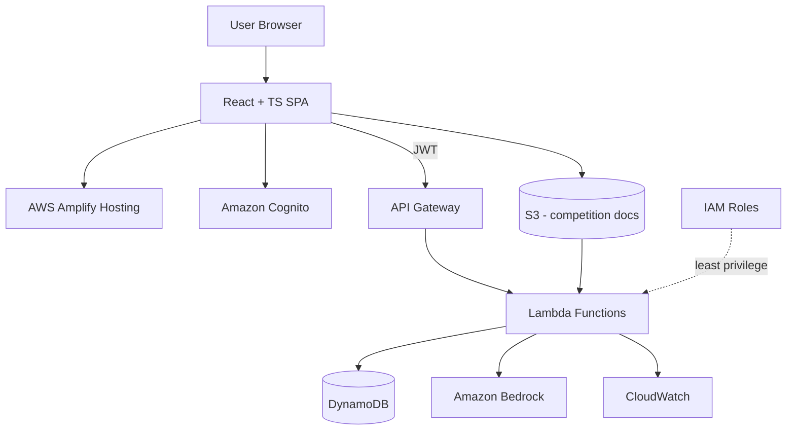

# HackMatch — Product & Technical Specification
**AWS First Commit Hackathon — 2 Developers, 2 Development Days**

> **"AI recommends. Humans decide."**

---

## 1. Product Scope

HackMatch has two directions:

- **Individual → Team**: an individual browses teams and gets AI-assisted team recommendations based on their skills.
- **Team Leader → Individual**: a leader defines a team's required skills and gets AI-assisted candidate recommendations.

**Hard rule:** AI never forms teams and never makes the final accept/reject decision. It only recommends; a human always decides.

**AI competition extraction is strictly limited to five fields:**
1. Competition name
2. Organizer
3. Deadline
4. Team size limits (min/max)
5. Eligibility

Everything else about a competition (problem statement, judging criteria, required skills, deliverables, tech stack, domain) is explicitly **out of scope**. Required skills are always entered manually by the team leader — never inferred by AI.

---

# PART A — MVP Product Guide

*The sections below explain what HackMatch does and how it behaves, in plain terms, for a reader who has never seen the product before. Every workflow follows the same pattern: **User Action → System Processing → Result.***

## A.1 MVP Feature Inventory

### Authentication

| | |
|---|---|
| **Purpose** | Let people create an account, prove who they are, and keep their data private/ownership-checked. |
| **Who uses it** | Everyone (individuals and leaders — the same account type can be either). |
| **Input** | Email + password; on first login, a choice of **Student** or **Professional / Other**. |
| **System does** | Amazon Cognito creates the account, sends an email-verification link, and issues a JWT on successful login. |
| **Output** | Verified account, logged-in session, access to the dashboard. |
| **Validations** | Email must be verified before full access; JWT required on every API call; logout invalidates the session client-side. |

The Student / Professional-Other choice is asked once, right after signup, because it determines whether the profile form later asks for **College Name** or **Organization Name** — this single field drives the eligibility system described in A.8.

### User Profile

| Field | Student | Professional/Other | Required? | Why it matters for matching |
|---|---|---|---|---|
| Name | ✅ | ✅ | Required | Display only |
| College Name / Organization Name | ✅ (College) | ✅ (Organization) | Required | Drives eligibility filtering (A.8) |
| Email | ✅ | ✅ | Required | Login/contact |
| Skills | ✅ | ✅ | Required | Core input to every match calculation |
| GitHub | ✅ | ✅ | Required | Contact/profile info only — not scraped in MVP |
| LinkedIn | ✅ | ✅ | Required | Contact/profile info only |
| Interests | ✅ | ✅ | Required | Shown on profile, not scored |
| Competition Preferences | ✅ | ✅ | Required | Boosts relevance when a team is in the same competition |
| Availability | ✅ | ✅ | Required | Secondary matching signal (e.g. "weekends") |
| Role Preference | ✅ | ✅ | Required | Secondary matching signal (e.g. "ML Engineer") |
| Portfolio, Projects, Experience | ✅ | ✅ | Optional | Shown on profile for human review only — not scored |
| Gender | ✅ | ✅ | Optional | Stored only if provided; **never used in matching** |

**Why each required field matters:** Skills are the primary matching input in both directions. Competition preference tells HackMatch which teams to prioritize surfacing to an individual. College/organization is what makes eligibility filtering possible at all. Availability and role preference let a leader distinguish two otherwise-equal candidates (e.g. two ML-skilled candidates, but only one is free on weekends and wants an "ML Engineer" role).

---

## A.2 Competition Feature — How Competitions Get Into the System

A leader can add a competition four ways: pasting a URL/description, uploading a document, or entering fields manually. Whichever source is used, AI extraction (when used) is limited to exactly **six fields**:

1. Competition Name
2. Organizer
3. Deadline
4. Minimum Team Size
5. Maximum Team Size
6. Eligibility

**AI must never extract:** required skills, problem statement, judging criteria, suggested technologies, domain knowledge, project type, deliverables, or any restriction beyond eligibility. If it isn't one of the six fields above, AI does not touch it — those things either aren't captured by HackMatch at all, or (in the case of required skills) are always entered manually by the leader in the next step.

| Step | User Action | System Processing | Result |
|---|---|---|---|
| 1 | Leader pastes a URL, pastes text, uploads a document, or chooses manual entry | If AI extraction is used: Bedrock reads the source and returns the six fields as structured JSON; the backend validates every field before showing it | A pre-filled competition form appears |
| 2 | Leader reviews the six fields | — | Leader can edit any field |
| 3 | If a field couldn't be reliably extracted | System leaves it blank rather than guessing | Leader fills it in manually — the UI never silently invents a value |
| 4 | Leader confirms | Competition record saved | Competition is now selectable when creating a team |

---

## A.3 Team Creation — Step by Step

| Step | User Action | System Processing | Result |
|---|---|---|---|
| 1 | Leader selects "Create Team" | — | Empty team form |
| 2 | Leader picks a competition | System shows that competition's min/max team size | Leader knows the size ceiling before adding requirements |
| 3 | Leader enters a team name | — | — |
| 4 | Leader manually lists the skills they want from **additional** members (not a re-statement of the competition — this is the leader's own judgment call) | Skills stored as a list, each optionally tagged High/Medium priority | Team's "required skills" list is set |
| 5 | Leader saves | Team record created with `status: recruiting`, current member = leader | Team appears in browse/search for individuals whose skills overlap |

**Explicitly not automatic:** HackMatch never derives required skills from the competition's problem statement — the leader always types them in. This keeps the AI's job narrow (metadata only) and keeps the leader in control of what "a good teammate" means for their specific project idea.

After creation, the leader can still edit the team name, required skills (add/remove/edit/re-prioritize), and manage current members. **Recruitment status** (Recruiting / Almost Full / Full / Closed) is computed automatically from current size vs. max size — see A.11.

---

## A.4 Team Skill Gap Analysis

This is the engine behind both "what does this team still need" (leader's view) and "why was I recommended to this team" (individual's view).

**Inputs:** the team's leader-defined required-skills list, and the union of every current member's declared skills.

**Calculation:**
```
covered   = requiredSkills ∩ (skills of all current members combined)
remaining = requiredSkills − covered
```

**Worked example**

Required: Python, Machine Learning, AWS, UI/UX
Current members collectively know: Python, AWS

| Covered | Remaining |
|---|---|
| Python, AWS | Machine Learning, UI/UX |

**When does it recalculate?** Every time team membership changes — a join request is accepted, an invitation is accepted, or a member leaves. The moment membership changes, the new member's skills are folded into the "collective skills" set, covered/remaining are recomputed, and (optionally) fresh candidate recommendations are pulled so the leader immediately sees who's now relevant to the *new* gap.

This calculation is entirely deterministic — no AI involved — which is what makes it possible to show a plain coverage fraction (e.g. "2 of 4 skills covered") instead of an opaque score.

---

## A.5 Individual → Team: Complete Workflow

| Stage | User Action | System Processing | Result Shown |
|---|---|---|---|
| Sign up | Choose Student/Professional-Other, verify email | Cognito account created | Logged in |
| Build profile | Enter skills, competition preferences, availability, role preference (+ optional fields) | Profile saved to DynamoDB | Profile complete |
| Find Team | Browse or search open teams | Deterministic eligibility filter removes ineligible teams; skill overlap is computed for the rest; optional Bedrock explanation text is generated | List of recommended teams, each with a match explanation |
| Open a team | Tap a team card | — | Team detail view: competition, eligibility, current members, required skills, current covered/remaining skills, and *why this team was recommended to you* |
| Send Join Request | Tap "Request to Join" | Backend checks: not already a member, no existing pending request, team not full, individual is eligible | Request created with `status: pending` |
| Wait | — | Leader is notified (see A.13) | Request visible to individual as "Pending" |
| Leader decides | Leader accepts or rejects | On accept: individual added to `memberIds`, skill gap recalculated, team size updated. On reject: request marked `rejected`, nothing else changes | Individual sees "Accepted" (now shows up as a team member) or "Rejected" |

The individual never sees teams that fail deterministic eligibility (e.g., a college-restricted competition they don't qualify for) — those are filtered out before recommendations are even generated, not just visually hidden.

---

## A.6 Leader → Individual: Complete Workflow

| Stage | User Action | System Processing | Result Shown |
|---|---|---|---|
| Create team | See A.3 | — | Team exists with required skills |
| View team state | Open Leader Dashboard | Gap analysis runs (A.4) | Covered skills, remaining skills, current members |
| Find candidates | Tap "Recommended Candidates" | Deterministic filter: eligibility, institution restriction, not already a member, team has open capacity. Remaining candidates scored by skill overlap with the **remaining gap** (not the whole requirement list), then availability/role preference as secondary signals. Optional Bedrock explanation generated from the matched/missing skill data only | Ranked candidate list, each with a plain-language reason |
| Review a candidate | Tap a candidate card | — | Candidate profile: skills, interests, availability, role preference, GitHub/LinkedIn, optional portfolio/projects/experience, and the match explanation |
| Invite | Tap "Invite" | Backend checks: team not full, candidate not already invited/member | Invitation created with `status: pending` |
| Wait | — | Candidate is notified | Invitation shown to leader as "Pending" |
| Candidate decides | Candidate accepts or declines | On accept: candidate added to `memberIds`, skill gap recalculated, recommendations refresh. On decline: invitation marked `declined` | Leader sees "Accepted" (roster updates) or "Declined" |

The leader always makes the final call on who to invite, and the candidate always makes the final call on whether to join — HackMatch's role stops at surfacing a ranked, explained shortlist.

---

## A.7 Matching Logic — Both Directions, Side by Side

| Factor | Team → Individual | Individual → Team |
|---|---|---|
| Skill comparison | Candidate skills vs. team's **remaining** gap | Individual's skills vs. team's required skills |
| Eligibility | Filtered out before scoring (deterministic) | Filtered out before scoring (deterministic) |
| Competition preference | Candidate listed this competition as preferred → relevance boost | Individual listed this competition as preferred → relevance boost |
| Availability | Secondary signal | Secondary signal |
| Role preference | Secondary signal | Secondary signal |
| Team capacity | Only candidates for teams with open slots are shown | Only teams with open slots are shown |
| Output | Ranked candidates + explanation | Ranked teams + explanation |

Eligibility is always resolved **before** any scoring happens — an ineligible person is never scored, ranked, or explained, they simply don't appear. AI (Bedrock) is only involved in two of these rows in an optional capacity: interpreting near-synonym skills (e.g. "ML" vs "Machine Learning") and writing the final explanation sentence from the already-computed matched/missing skill lists. AI never decides eligibility and never invents a reason that isn't backed by actual profile data.

---

## A.8 Eligibility System

Every competition stores an explicit eligibility rule, evaluated deterministically:

| Competition type | Rule | Example |
|---|---|---|
| Open to everyone | No restriction | Any user is eligible |
| Students only | `studentOnly: true` | Professional/Other users filtered out |
| Specific college/university | `institutionRestriction: true`, `allowedInstitutions: [...]` | Only users whose `collegeName` is in the list are eligible |
| Specific organization | Same mechanism, using `organizationName` for non-students | Only matching-org users are eligible |
| Inter-college/inter-university not allowed | Same `institutionRestriction` mechanism | A team's members (and any candidate) must all share an allowed institution |

**Critical safeguard:** if a competition has *no* institution restriction set, the system must not filter anyone out based on college/organization — an unset restriction always means "open," never "restricted by default." This prevents a common bug where blank data accidentally excludes everyone.

Eligibility is checked **before** a team or candidate ever enters the recommendation pool — it's a gate, not a ranking factor.

---

## A.9 Join Request Workflow

```
Individual sends request → pending → Leader reviews → Accept / Reject
```

| Check | When | Behavior |
|---|---|---|
| Authentication | On send | Only a logged-in user can send a request |
| Duplicate prevention | On send | A user can't have two pending requests to the same team |
| Eligibility | On send | Ineligible individuals cannot send a request at all |
| Team capacity | On send *and again* on accept | Prevents joining an already-full team, even if it filled up while the request was pending |
| Existing membership | On send | Current members can't request to join their own team |
| **On accept** | | User added to team, team size +1, collective skills updated, skill gap recalculated, recruitment status re-evaluated |
| **On reject** | | Request marked `rejected`; no other state changes; individual can request other teams |

---

## A.10 Invitation Workflow

```
Leader selects candidate → sends invitation → pending → Candidate Accepts / Declines
```

| Check | When | Behavior |
|---|---|---|
| Duplicate prevention | On send | A leader can't send two pending invitations to the same candidate for the same team |
| Team capacity | On send *and again* on accept | Same re-validation logic as join requests |
| Candidate eligibility | On send | A leader cannot invite an ineligible candidate |
| **On accept** | | Candidate added to team, team size +1, collective skills updated, skill gap recalculated, candidate recommendations refresh |
| **On decline** | | Invitation marked `declined`; team stays open; leader can invite others |

---

## A.11 Team Capacity & Recruitment Status

Recruitment status is computed, not manually set:

| Status | Condition |
|---|---|
| **Recruiting** | Current size < max size, and below an "almost full" threshold (e.g. one slot away from full also falls here unless you want a distinct state) |
| **Almost Full** | Exactly one slot remaining |
| **Full** | Current size = max size |
| **Closed** | Leader manually stops recruiting (optional MVP toggle) |

The backend is the single source of truth: it re-checks capacity at the moment a join request or invitation is *accepted*, not just when it was *sent*, since the team's size can change in between. The frontend showing "Full" is a convenience, not the enforcement mechanism.

---

## A.12 Dashboards

### Individual Dashboard shows
Profile summary (skills, competition preferences), recommended teams, sent join requests with status, received invitations with status, current team (if any) with live skill-gap view.

### Leader Dashboard shows
Team info (name, competition, deadline, eligibility), current members, team size vs. max, required skills, covered skills, remaining skill gaps, recommended candidates, pending join requests, sent invitations, recruitment status.

Both dashboards are read views over the same underlying state — there is no separate "notification database," just current status fields on requests/invitations/teams (see A.13).

---

## A.13 Status Updates Visible to Users

| Event | Who sees it | Where |
|---|---|---|
| Join request received | Leader | Leader Dashboard → Pending Join Requests |
| Join request accepted/rejected | Individual | Individual Dashboard → My Requests |
| Invitation received | Individual | Individual Dashboard → My Invitations |
| Invitation accepted/declined | Leader | Leader Dashboard → Sent Invitations |
| Team becomes full | Leader (and it disappears from individuals' browse results) | Leader Dashboard status badge |
| Team membership changes | Both leader and existing members | Dashboards reflect new roster + recalculated skill gap |

For the MVP these are simply status fields the dashboards poll/read on load — a full push-notification system (EventBridge, email, etc.) is explicitly deferred (see §13, "What NOT to Build").

---

## A.14 AI vs. Deterministic Responsibilities (Product View)

| AI (Bedrock) handles | Backend (deterministic) handles |
|---|---|
| Competition metadata extraction — only the six approved fields | Authentication & authorization |
| Semantic skill matching ("ML" ≈ "Machine Learning") | Eligibility (including all institution restrictions) |
| Recommendation explanation text, generated only from matched/missing skill data | Team capacity, duplicate prevention, membership state |
| | Join-request and invitation state transitions |
| | Skill-gap calculation |
| | Final accept/reject/invite actions |

AI is never allowed to invent a user's qualifications, skills, experience, or eligibility — it only describes what the deterministic layer already computed. This is the practical meaning of **"AI recommends, humans decide"**: the leader decides who joins; the individual decides whether to accept an invitation; AI never has write access to team membership.

*(See §11, "Deterministic vs. AI — Decision Table," for the engineering-level version of this same split.)*

---

## A.15 Complete End-to-End Example

**Leader side:**
1. A leader creates a team for an AI competition and pastes the competition's public page.
2. AI extracts: name, organizer, deadline, min/max team size, eligibility. The leader reviews and confirms these six fields.
3. The leader manually enters required skills: **Machine Learning, AWS, UI/UX**.
4. The current team (just the leader) covers **AWS**. The dashboard shows:
   - Covered: AWS
   - Remaining: Machine Learning, UI/UX
5. HackMatch filters candidates by eligibility, then ranks by overlap with the remaining gap. It recommends an eligible candidate whose skills include Machine Learning, with the explanation: *"Fills the team's Machine Learning requirement."*
6. The leader opens the candidate's profile, reads the explanation, and sends an invitation.
7. The candidate accepts. They're added to the team; the dashboard recalculates:
   - Covered: AWS, Machine Learning
   - Remaining: UI/UX
8. HackMatch now surfaces a new recommended candidate whose skills include UI/UX.

**Individual side (same team, reverse direction):**
1. A different individual, whose skills include AWS and UI/UX and who listed this same competition as a preference, opens "Find Team."
2. HackMatch checks eligibility first (they qualify), then shows this team with the explanation: *"You match 2 of the team's 3 requested skills, and you've marked this competition as a preference."*
3. The individual reviews the team's required skills and current gap, then sends a join request.
4. The leader sees the pending request on the Leader Dashboard, reviews the individual's profile and match explanation, and accepts.
5. The individual becomes a team member; team size, covered skills, and remaining gap all update immediately for everyone viewing the team.

This single example threads together profile data, competition metadata, manual requirement entry, deterministic eligibility, skill-gap calculation, AI-assisted ranked recommendations with explanations, and a human decision on both sides — the complete MVP loop.

---

# PART B — Technical Architecture & Implementation Plan

## 2. Core Matching Model

**Deterministic first, AI second.** Skill overlap is a set comparison; AI is used only for (a) extracting competition metadata, (b) optional semantic skill equivalence ("ML" ≈ "Machine Learning"), and (c) writing a plain-language explanation of a match that already happened deterministically.

### Team → Individual
```
matched   = candidateSkills ∩ requiredSkills
missing   = requiredSkills - candidateSkills
coverage  = |matched| / |requiredSkills|
```
> "Recommended because you match 3 of the team's 4 requested skills, including AWS and Python."

### Individual → Team
Same set comparison, run from the individual's perspective against every open team, optionally boosted if the individual listed that team's competition as a preference.

### Explanation rule
The explanation text (LLM-generated via Bedrock) must be constructed **only** from the matched/missing skill lists and competition-preference flag that the deterministic layer already computed. The LLM is never given free rein to describe candidate "experience" or "fit" beyond what's in the structured data — this prevents invented claims.

---

## 3. Eligibility Model (Deterministic)

Competition eligibility is stored as structured data, not free text, so it can be evaluated with plain conditionals rather than an LLM judgment call.

```json
"eligibility": {
  "studentOnly": true,
  "institutionRestriction": true,
  "allowedInstitutions": ["ABC College"]
}
```

Evaluation logic:
```
function isEligible(user, competition):
    e = competition.eligibility
    if e.studentOnly and user.userType != "student":
        return false
    if e.institutionRestriction:
        userOrg = user.collegeName or user.organizationName
        return userOrg in e.allowedInstitutions
    return true   # no restriction → do not filter
```
Key safeguard: **absence of `institutionRestriction` must never be treated as a restriction.** Default to `false`/unset = open competition. This prevents the common bug of over-filtering candidates because a field was blank.

---

## 4. User Profile Schema

Common required fields: Name, Email, Skills, GitHub, LinkedIn, Interests, Competition Preferences, Availability, Role Preference.
Branch field: `collegeName` (students) OR `organizationName` (non-students), selected via a single "Student / Professional" toggle at signup.

Optional: Portfolio, Projects, Experience, Gender.

**Gender handling:** stored only if the user chooses to provide it, never required, never used as a matching or ranking signal in the MVP. If a future gender-diversity feature is added, it must be an explicit opt-in filter the *user* controls — not a hidden weight in the recommendation score.

```json
{
  "userId": "user_123",
  "name": "Aisha",
  "userType": "student",
  "collegeName": "BTKIT",
  "organizationName": null,
  "email": "aisha@example.com",
  "skills": ["Python", "Machine Learning", "AWS"],
  "github": "github-url",
  "linkedin": "linkedin-url",
  "interests": ["AI", "Cloud"],
  "competitionPreferences": ["competition_123"],
  "availability": "weekends",
  "rolePreference": ["ML Engineer"],
  "portfolio": null,
  "projects": [],
  "experience": [],
  "gender": null
}
```

Matching weight tiers:
1. Skills (primary)
2. Competition preference match (primary)
3. Eligibility (gate, not a score)
4. Role preference (secondary)
5. Availability (secondary)
6. Projects/experience/portfolio (supporting, display-only in MVP — not scored)

GitHub/LinkedIn are stored as contact links only; **no scraping** in the 2-day build.

---

## 5. Team & Competition Schema

```json
{
  "teamId": "team_123",
  "name": "VisionX",
  "leaderId": "user_001",
  "competitionId": "competition_123",
  "memberIds": ["user_001", "user_002"],
  "requiredSkills": [
    {"skill": "Machine Learning", "priority": "high"},
    {"skill": "AWS", "priority": "high"},
    {"skill": "UI/UX", "priority": "medium"}
  ],
  "maxMembers": 4,
  "status": "recruiting"
}
```

```json
{
  "competitionId": "competition_123",
  "name": "AI Innovation Challenge",
  "organizer": "Example Organization",
  "deadline": "2026-09-30T23:59:00Z",
  "teamSizeMin": 2,
  "teamSizeMax": 4,
  "eligibility": {
    "studentOnly": true,
    "institutionRestriction": true,
    "allowedInstitutions": ["Example University"]
  },
  "sourceType": "uploaded_document"
}
```

### Team gap analysis
```
covered   = requiredSkills ∩ (∪ memberSkills)
remaining = requiredSkills - covered
coverage% = |covered| / |requiredSkills|   // shown as a plain fraction, not an "AI score"
```
Recalculated on every membership change.

---

## 6. DynamoDB Design

For a 2-day build, favor **simplicity over single-table elegance** — six small tables with clear ownership are easier for two people to build in parallel than one cleverly overloaded table.

| Table | PK | SK / GSI | Notes |
|---|---|---|---|
| `Users` | `userId` | GSI: `collegeName`/`organizationName` (for eligibility lookups) | |
| `Competitions` | `competitionId` | — | |
| `Teams` | `teamId` | GSI: `competitionId` (browse teams per competition) | |
| `JoinRequests` | `requestId` | GSI: `teamId`, GSI: `userId` | status: pending/accepted/rejected/cancelled |
| `Invitations` | `invitationId` | GSI: `teamId`, GSI: `userId` | status: pending/accepted/declined/cancelled |

Recommendations are **not** persisted — they're computed on read (Lambda query + in-memory filter/score) and returned directly, since candidate pools are small for a hackathon demo and storing stale scores adds complexity for no benefit.

If time allows on Day 2, a single-table design can be introduced for `JoinRequests`+`Invitations` (same access pattern), but don't start there.

---

## 7. API Design (MVP surface only)

| Endpoint | Auth | Purpose |
|---|---|---|
| `POST /profiles` | Cognito | Create profile |
| `GET/PUT /profiles/:id` | Cognito, owner-only on PUT | Read/update |
| `POST /competitions` | Cognito | Create competition record |
| `POST /competitions/:id/analyze` | Cognito | Bedrock extraction → returns fields for review |
| `POST /teams` | Cognito | Create team (creator becomes leader) |
| `GET/PUT /teams/:id` | Cognito, leader-only on PUT | Read/update requirements |
| `GET /teams/:id/recommendations` | Cognito, leader-only | Candidate list with explanations |
| `GET /users/:id/recommended-teams` | Cognito, self-only | Team list with explanations |
| `POST /teams/:id/join-request` | Cognito | Individual requests to join |
| `POST /join-requests/:id/approve` \| `/reject` | Cognito, leader-only | |
| `POST /teams/:id/invite` | Cognito, leader-only | |
| `POST /invitations/:id/accept` \| `/decline` | Cognito, invitee-only | |

Example — candidate recommendations:
```
GET /teams/team_123/recommendations
```
```json
{
  "recommendations": [
    {
      "userId": "user_456",
      "matchedSkills": ["AWS", "Machine Learning"],
      "missingSkillsFilled": ["Machine Learning"],
      "matchReason": "Matches the team's AWS and Machine Learning requirements.",
      "competitionPreferenceMatch": true
    }
  ]
}
```

**Validation rules enforced server-side, never trusted from the frontend:**
- User identity comes from the verified Cognito JWT, never a request body field.
- Team ownership is re-checked in Lambda before any mutation (`team.leaderId === callerId`).
- Team-size and eligibility are re-validated at accept-time, not just at request-time (team composition may have changed).
- Duplicate join-requests/invitations are rejected at the DB layer (conditional writes on a composite `teamId#userId` key).

---

## 8. AWS Architecture

**Stack:** React + TypeScript → AWS Amplify Hosting → Amazon Cognito (auth) → Amazon API Gateway → AWS Lambda → Amazon DynamoDB, with Amazon Bedrock for extraction/semantic matching/explanations, Amazon S3 for uploaded competition documents, IAM for least-privilege roles, CloudWatch for logs/monitoring.

Explicitly deferred unless the core flow is already solid: OpenSearch, EventBridge, Step Functions.



### Request flows
- **Auth:** React → Cognito → JWT → API Gateway (JWT authorizer) → Lambda.
- **Profile/Team CRUD:** React → API Gateway → Lambda → DynamoDB.
- **Competition extraction:** pasted text / S3 document → Lambda → Bedrock (structured JSON prompt) → Lambda validates schema → returned to frontend for human review → on save, DynamoDB.
- **Gap analysis:** requiredSkills + current member skills → Lambda (deterministic set comparison, optional Bedrock semantic pass) → DynamoDB update.
- **Candidate matching:** deterministic eligibility/skill filter in Lambda → optional Bedrock explanation generation → response to frontend (not persisted).

---

## 9. Amazon Bedrock — What It's For (and Not For)

**Use Bedrock for:**
1. Competition metadata extraction → structured JSON output, validated server-side before storage.
2. Semantic skill equivalence ("ML" ↔ "Machine Learning") — a small hardcoded synonym dictionary should cover the MVP demo cases; Bedrock is a nice-to-have fallback, not the primary mechanism.
3. Recommendation explanation text — generated strictly from already-computed matched/missing skill lists.

**Never use Bedrock for:** authentication, authorization, team-size checks, duplicate-request checks, eligibility decisions when a deterministic rule exists, database writes, or the final accept/reject decision.

### Structured-output contract
```json
{
  "name": "",
  "organizer": "",
  "deadline": "",
  "team_size_min": null,
  "team_size_max": null,
  "eligibility": ""
}
```
Backend validates every field (types, deadline is a parseable date, team_size_min ≤ team_size_max) before it ever reaches DynamoDB. On failure, show: *"Unable to automatically extract all competition details. Please review and enter the missing information."* — never silently store a partially-hallucinated record.

---

## 10. AI Reliability Risks & Mitigations

| Risk | Mitigation |
|---|---|
| Competition-extraction hallucination | Structured JSON schema, backend validation, mandatory human review before save, source text stored alongside |
| Skill-matching errors ("ML" vs "Machine Learning" treated as unrelated) | Deterministic synonym dictionary first; Bedrock only as a semantic fallback |
| Fabricated candidate "experience" in explanations | Explanation prompt is given only the matched/missing skill arrays — no free-text profile fields — so it has nothing to invent from |
| Prompt injection inside an uploaded competition document | Treat document content as untrusted data in the prompt (clearly delimited), request structured-JSON-only output, validate/ignore any instruction-like text in the extracted fields before display |
| AI overconfidence | All recommendation UI copy uses "recommended" / "may be a fit" phrasing, never certainty language like "perfect match" |

---

## 11. Deterministic vs. AI — Decision Table

| Task | Deterministic | AI |
|---|---|---|
| Login | Yes | No |
| Authorization | Yes | No |
| Team size validation | Yes | No |
| Eligibility check | Yes | No |
| Duplicate request check | Yes | No |
| Skill overlap | Yes | Optional (synonym expansion) |
| Competition metadata extraction | No | Yes |
| Semantic skill equivalence | Optional dictionary | Yes (fallback) |
| Recommendation explanation | No | Yes |

**Why:** every task with a legal/data-integrity consequence (who gets in, whether a team is full, whether a request is a duplicate) must be reproducible and auditable — a rule, not a model call. AI is reserved for the two things it's actually good at here: turning messy text into structured data, and turning structured data into readable prose. This also makes Developer 1's AI work fully testable against fixed JSON without needing the live backend.

---

## 12. Security Checklist

- Cognito-issued JWT verified on every API Gateway request (built-in JWT authorizer, not custom Lambda auth for MVP speed).
- Every mutating Lambda re-derives `callerId` from the verified token — never from the request body.
- Ownership checks in Lambda: team mutation requires `team.leaderId === callerId`; profile mutation requires `profile.userId === callerId`.
- IAM roles scoped per Lambda function (least privilege: a matching Lambda gets DynamoDB read-only on `Users`/`Teams`, not write).
- S3 bucket for uploaded competition docs: private, presigned-URL upload/download only.
- Input validation on every write (skill list length, string length caps, enum checks on `status`/`priority`).
- Duplicate-request prevention via conditional DynamoDB writes on a composite key.
- No secrets in Git — Bedrock/region config via environment variables and Amplify/Lambda config, not hardcoded.

---

## 13. What NOT to Build

Custom ML training, full social network, chat/real-time messaging, mobile app, microservices/Kubernetes, advanced analytics, payments, LinkedIn/GitHub scraping, organization administration, full notification infrastructure, OpenSearch, Step Functions — unless the core loop is done early and time remains.

**Goal: one complete, polished, working team-formation flow** — not five half-finished features.

---

## 14. MVP Scope

**Must have:** auth; profile creation with student/org branch; skills; competition creation + AI extraction + human review; manual team skill requirements; team creation; team member management; skill-gap calculation; candidate matching; explainable recommendations; individual→team recommendations; join request OR invitation (at least one); eligibility filtering; team-size validation; AWS deployment.

**Should have:** both join requests *and* invitations; search/filtering; competition-preference boosting; richer explanations; dashboard polish.

**Nice to have:** Bedrock semantic skill matching; S3 PDF upload; better ranking; better normalization.

**Post-hackathon:** OpenSearch, EventBridge, Step Functions, GitHub integration, portfolio analysis, org/university accounts, advanced matching models, messaging, analytics, reputation, verification.

---

## 15. Two-Day Execution Plan

### Day 1 — Foundation + Core Product
**Developer 1 (AI + product logic):** Bedrock extraction prompt + validation, skill-matching logic (deterministic + synonym dict), team gap-analysis function, recommendation-scoring function — all developed and tested against fixed mock JSON, independent of the live backend.
**Developer 2 (frontend + AWS):** React app scaffold, Cognito setup, API Gateway + Lambda skeletons, DynamoDB tables, profile + team CRUD APIs.
**Both:** repo setup, freeze API contracts (request/response JSON shapes) before diverging, first integration pass at end of day.

**End-of-Day-1 goal:** a user can log in, create a profile, create/select a competition, create a team, manually enter required skills, and see a basic (even if hardcoded/mocked) skill-gap view.

### Day 2 — Matching + Integration + Deployment
**Developer 1:** candidate recommendation endpoint logic, explanation generation, individual→team recommendations, competition-preference boosting.
**Developer 2:** join-request/invitation APIs, eligibility validation, team-size validation, frontend wiring to real endpoints, Amplify deployment.
**Both:** end-to-end test of the full loop, UI polish, bug fixing, README, demo run-through.

**Hard stop point:** once the full loop works end-to-end, freeze features. Remaining time goes only to bug fixes, reliability, UI polish, deployment stability, and documentation.

---

## 16. Ownership Split

| Developer 1 — AI + Product Logic | Developer 2 — Frontend + AWS Infra |
|---|---|
| Competition extraction (Bedrock prompt + validation) | React + TypeScript UI |
| Skill matching + synonym handling | Cognito integration |
| Team gap analysis | API Gateway + Lambda scaffolding |
| Candidate recommendation + explanation logic | DynamoDB schema + queries |
| Individual→team recommendation logic | S3, Amplify deployment |
| | Authorization/ownership checks |

Both should understand the full architecture; branches follow `feature/profile`, `feature/team`, `feature/matching`, `feature/bedrock`, `feature/auth` with conventional commits (`feat: add Cognito authentication`, etc.) to keep the two of you from colliding on the same files.

---

## 17. Demo Script (2–3 min)

1. Create a profile, enter skills.
2. Leader creates a team → pastes/uploads competition info.
3. Bedrock extracts the 5 metadata fields → leader reviews and confirms.
4. Leader manually enters required skills.
5. Current team members are analyzed → remaining skill gap shown.
6. HackMatch recommends a candidate with a plain-language explanation.
7. Leader invites (or candidate requests) → human accepts.
8. Team updates; gap recalculates live.
9. Brief look at the AWS architecture diagram.

Narrative thread to say out loud: **Competition context → human-defined requirements → AI-assisted matching → human decision → team formation.** Never claim HackMatch guarantees good teams — it surfaces candidates, people decide.

---

## 18. First 10 Implementation Tasks

| # | Task | Owner | Dependency | Est. Time | Definition of Done |
|---|---|---|---|---|---|
| 1 | Repo + AWS project setup (Amplify app, Cognito pool, DynamoDB tables) | Both | None | 1–2 hrs | Both can deploy a "hello world" Lambda through API Gateway |
| 2 | Freeze API contracts (JSON shapes for profile, team, competition, recommendations) | Both | Task 1 | 1 hr | Shared doc/mock JSON both devs code against |
| 3 | Cognito auth wired into React (signup/login) | Dev 2 | Task 1 | 2–3 hrs | User can sign up, log in, JWT reaches API Gateway |
| 4 | Profile create/read/update API + form | Dev 2 | Task 2 | 2–3 hrs | Profile persists in DynamoDB, visible on refresh |
| 5 | Competition create API + paste-text extraction endpoint (mocked Bedrock response OK initially) | Dev 1 | Task 2 | 2–3 hrs | `/competitions/:id/analyze` returns the 5-field JSON |
| 6 | Bedrock prompt + structured-output validation (real call) | Dev 1 | Task 5 | 2 hrs | Real Bedrock call returns validated JSON or a clear "review needed" fallback |
| 7 | Team create API + manual required-skills UI | Dev 2 | Task 4 | 2–3 hrs | Leader can create a team and add/edit/remove required skills |
| 8 | Team gap-analysis function (deterministic) | Dev 1 | Tasks 4, 7 | 1–2 hrs | Given team + members, returns covered/remaining skills and % coverage |
| 9 | Candidate recommendation endpoint (deterministic filter + skill overlap) | Dev 1 | Tasks 4, 7, 8 | 2–3 hrs | `/teams/:id/recommendations` returns ranked candidates with matched/missing skills |
| 10 | Explanation text generation via Bedrock, wired into recommendation response | Dev 1 | Task 9 | 1–2 hrs | Each recommendation includes a one-sentence, data-grounded explanation |

After task 10, both developers converge on join-request/invitation flows, eligibility + team-size validation, and end-to-end integration for the rest of Day 1 into Day 2.
